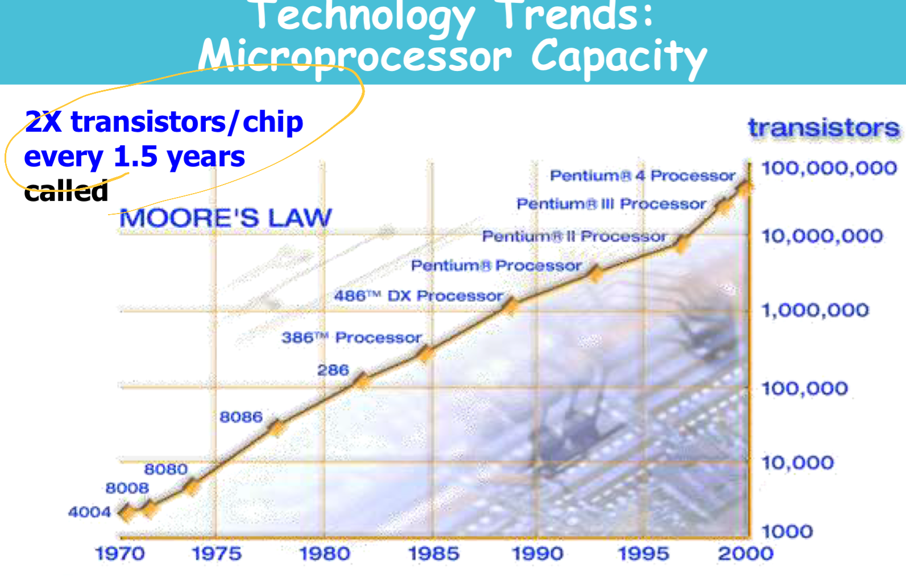
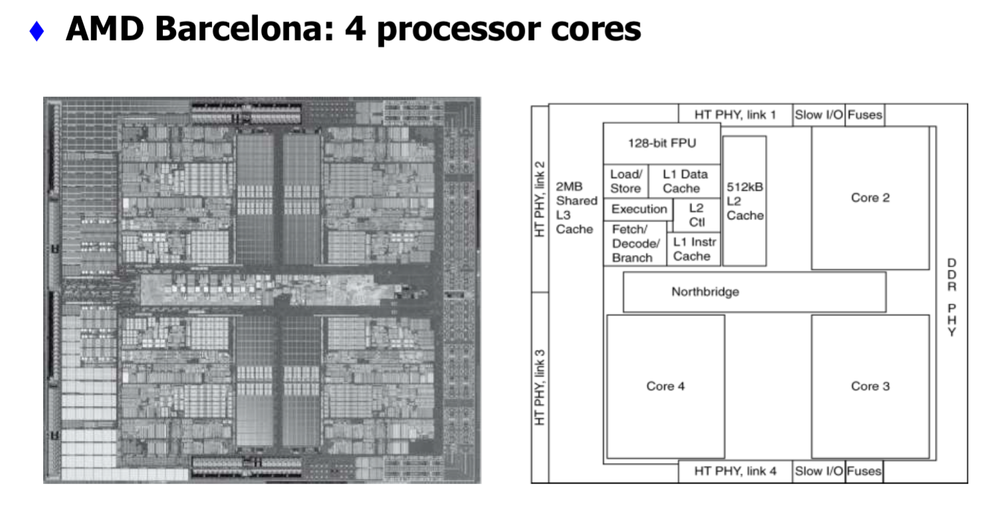
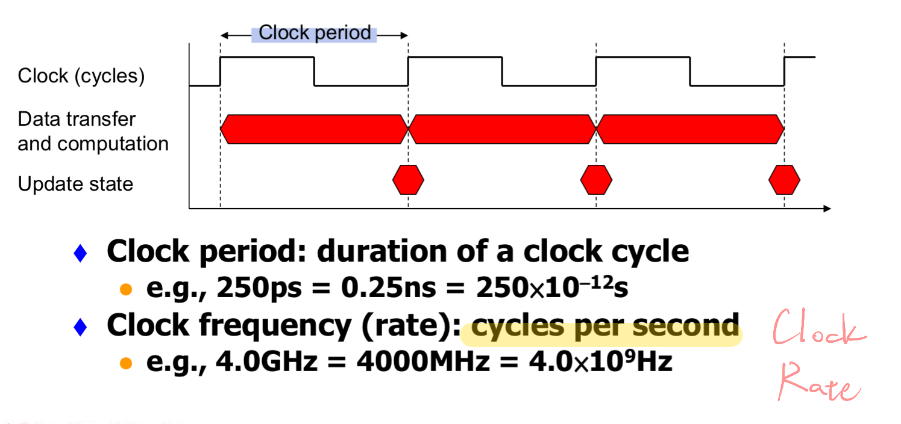
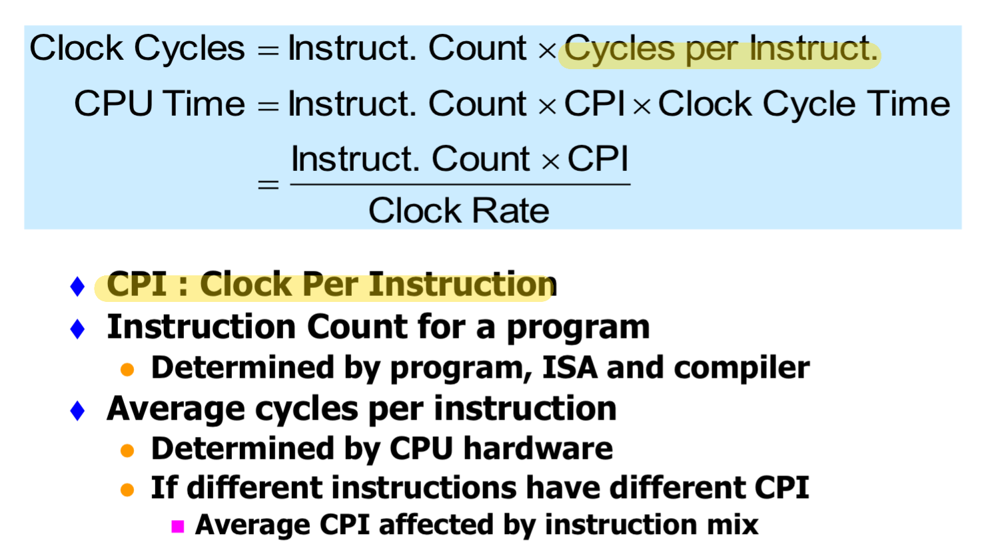
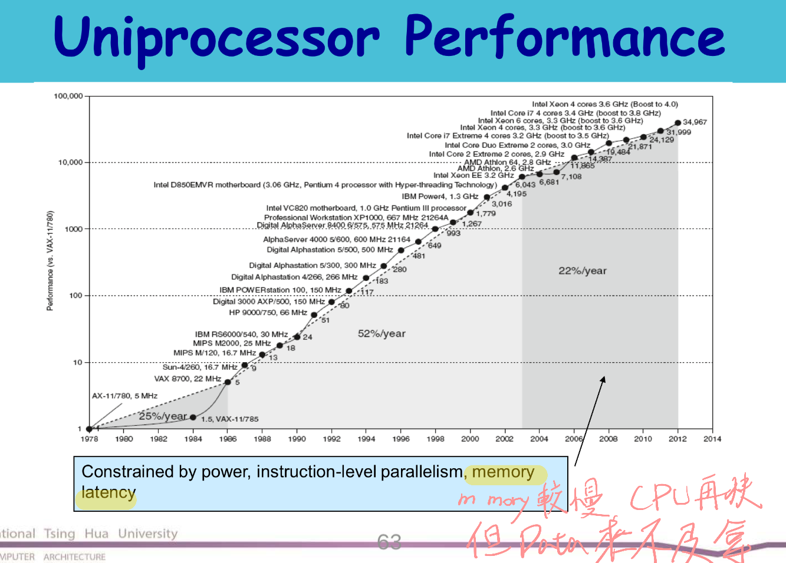
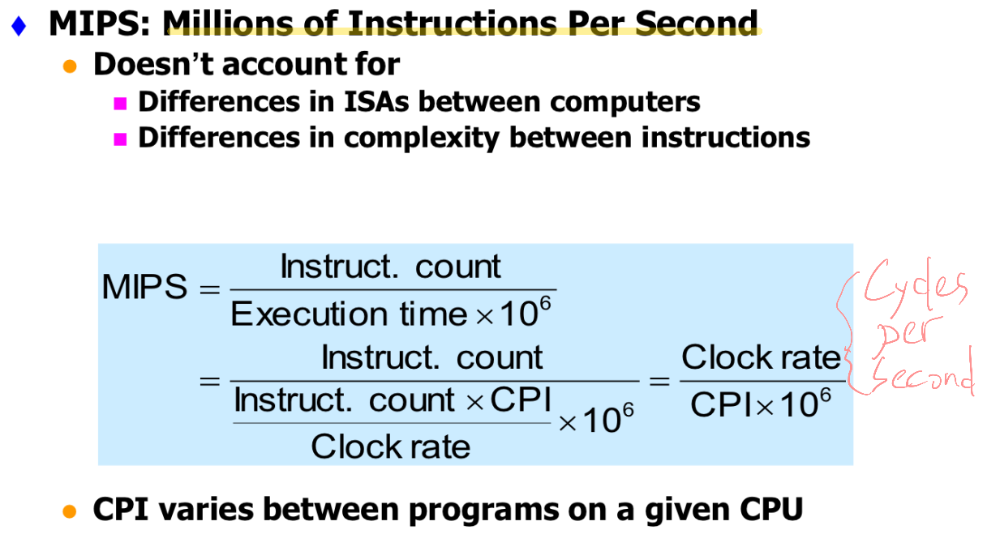

* Computer: A historical perspective
    * 2x transistors/chips every 1.5 years

        

* Abstractions
    * Inside the Processor

        

* Technology
    * Performance
        * Definition
            * Response Time / Throughput

            

        * CPU performance
            * CPU Clocking

                

            * Instruction Count and CPI

                
    
    * Power trends: multi-processing

        

    * Measuring and evaluating performance
    * Cost
        * MIPS: Millons of Instructions Per Second
        
            
