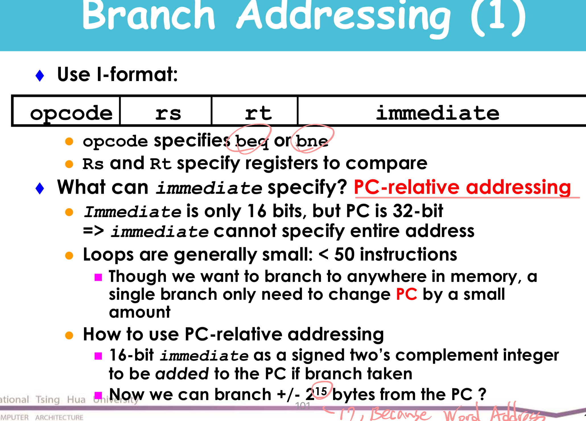
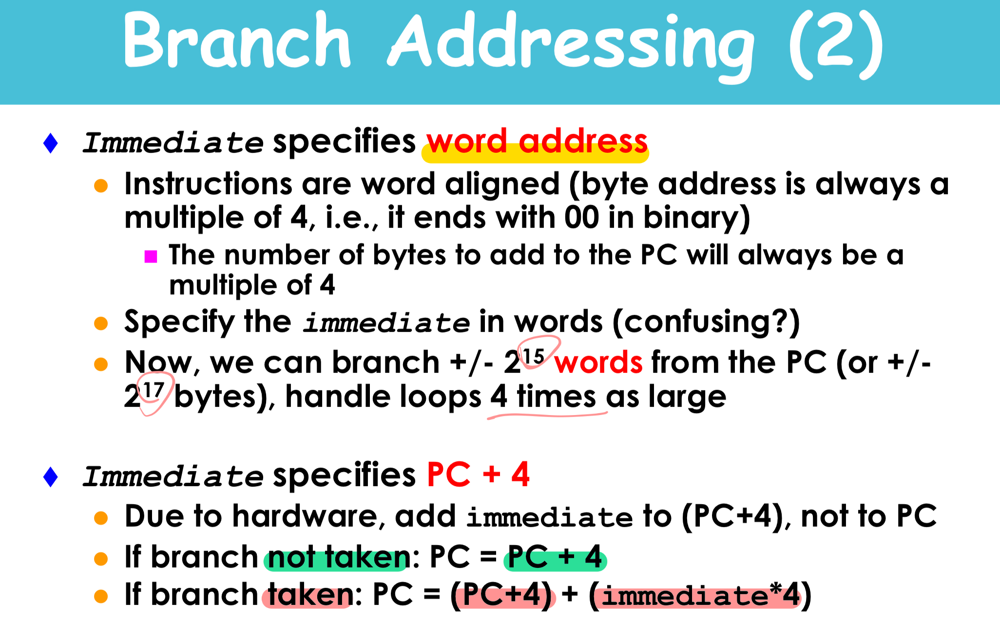
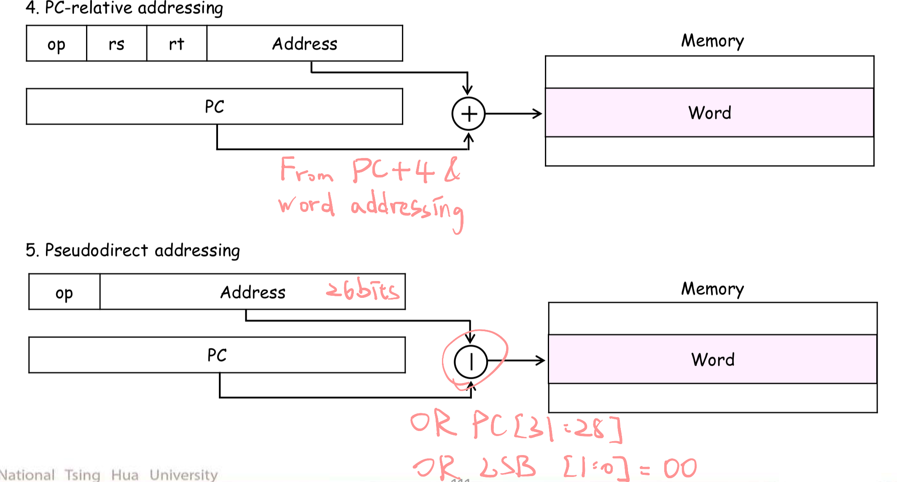

* Instruction set architecture
* Operands
    * Register operands and their organization
    * Memory operands, data transfer
    * Immediate operands
* Signed and unsigned numbers
* Representing instructions
* Operations
    * Logical
    * Decision making and branches
* Supporting procedures in hardware
* Communicating with people
* Addressing for 32-bit immediate and addresses
    * Branch addresing
        * 'immediate' word address could add two more bits (15 -> 17) for addr representation

        
        

        * MIPS addressing mode (Immediate, Register, Base, PC-releative and Pseudodirect)

        
         

* Translating and starting a program
* A sort example
* Arrays versus pointers
* ARM and x86 instruction sets