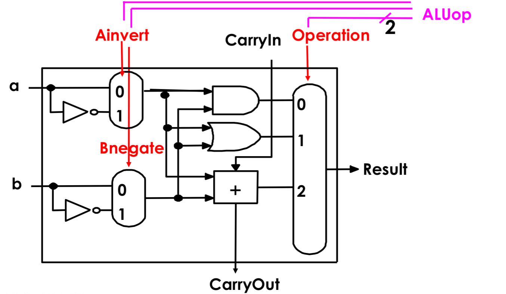
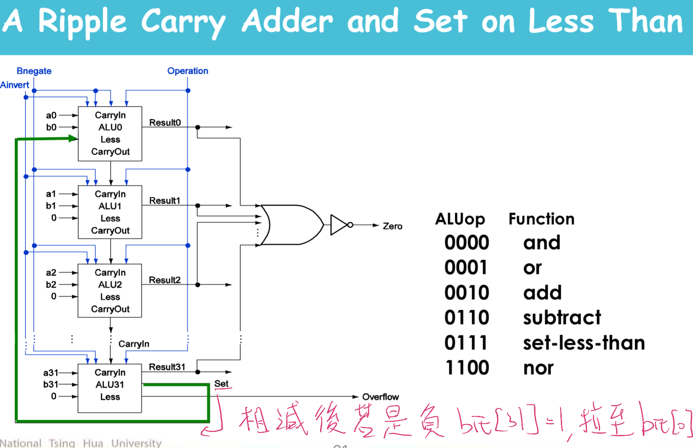
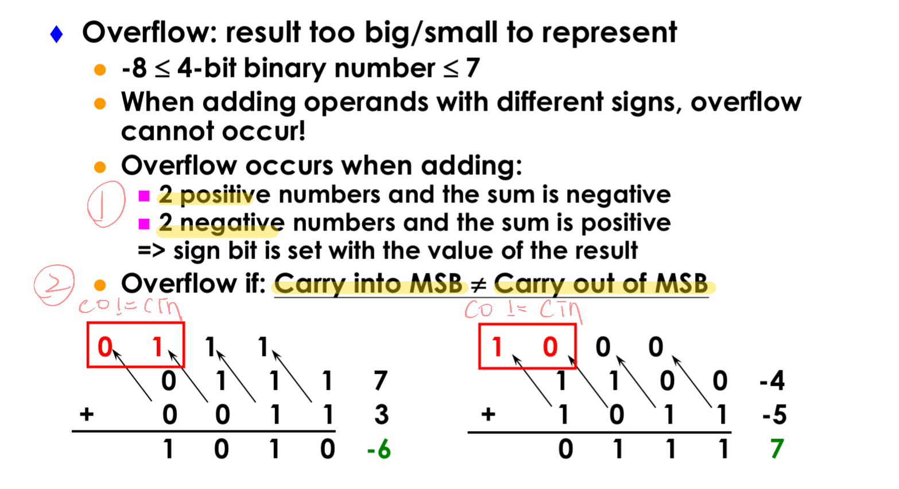
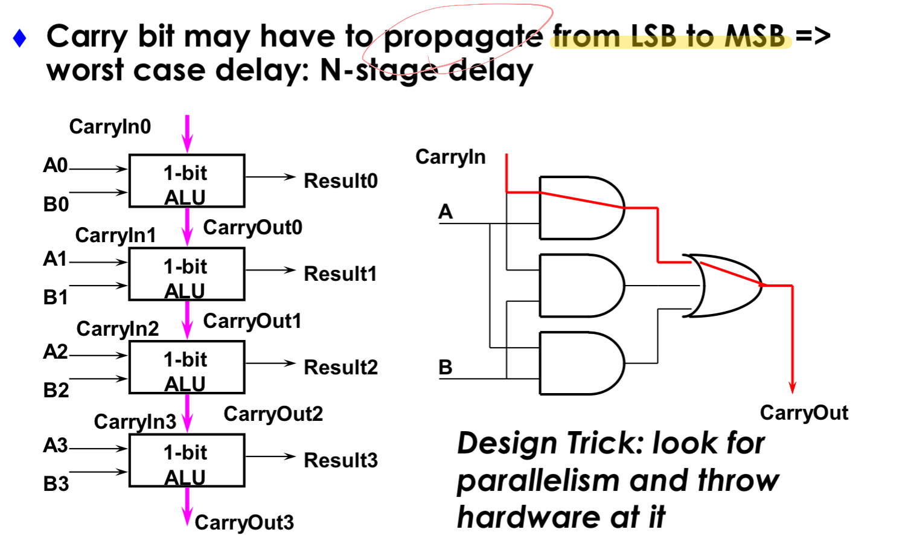
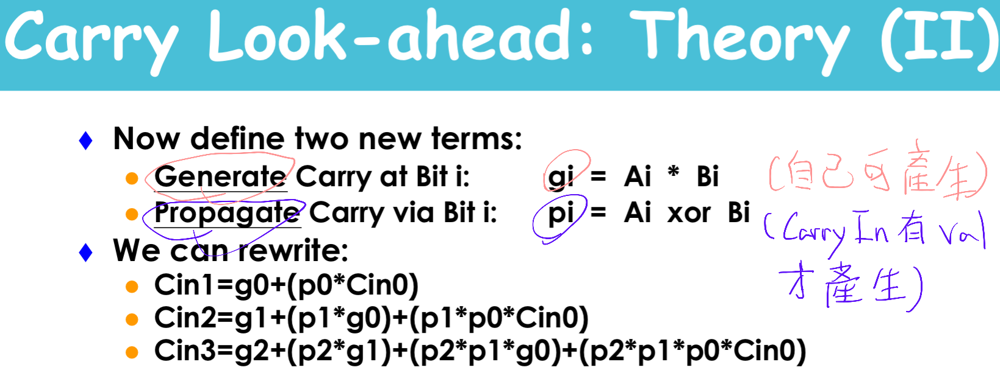
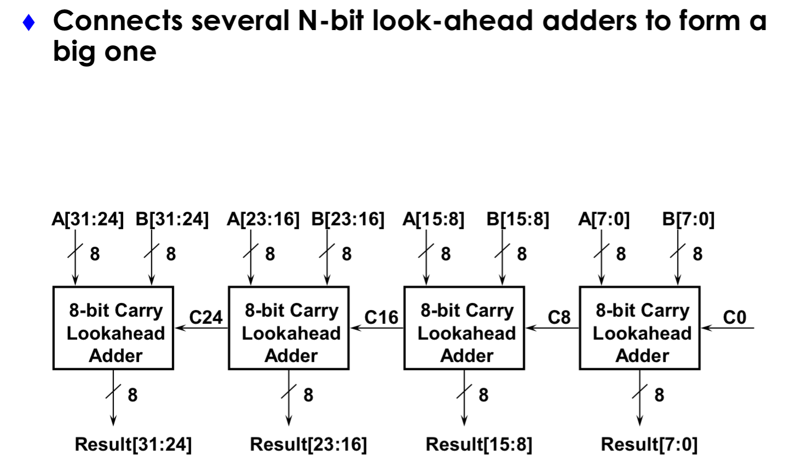
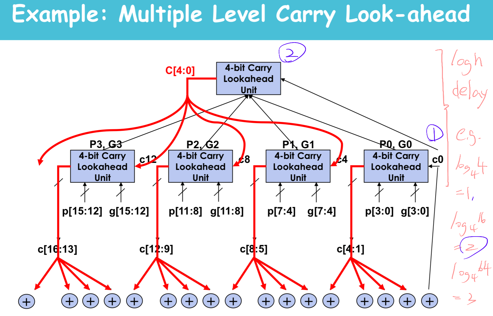
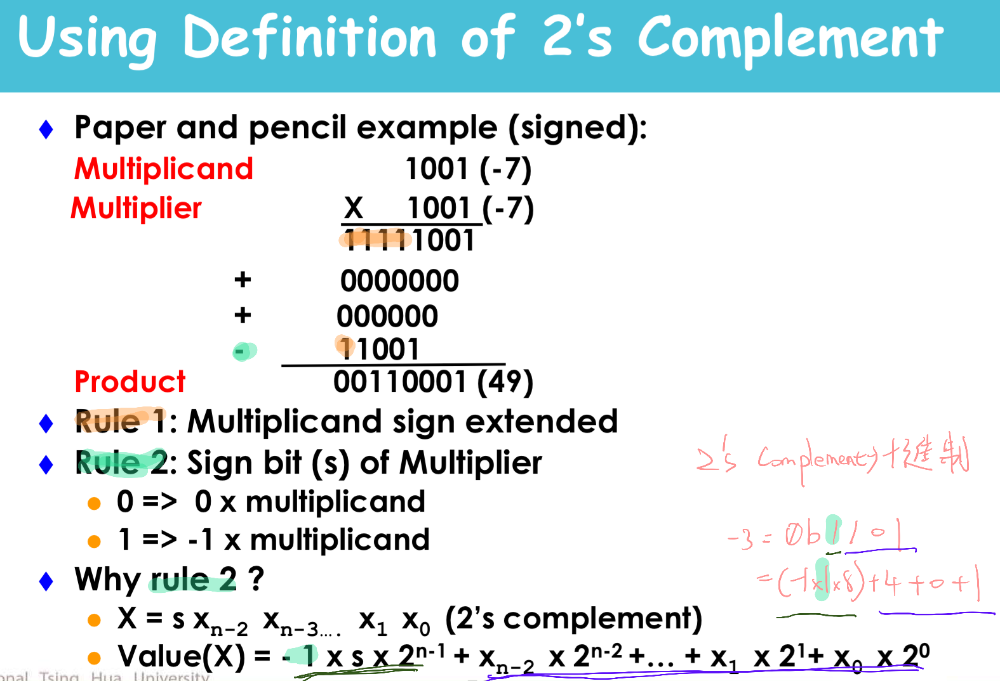
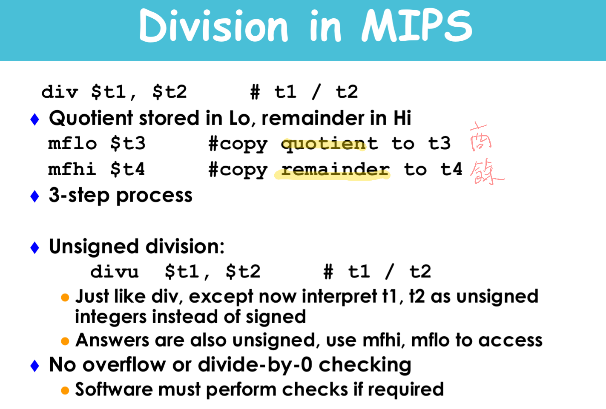

* Addition and subtraction (Sec. 3.2)
* Constructing an arithmetic logic unit (Appendix C)
    * Building ALU

        
        

        * Add, sub, and, or, nor
        * Set-on-less-than, overflow detection, zero detection
            * set-on-less-than
                
                

            * overflow detection

                

    * Fast adders
        * Poor Ripple Carry Adder

            

        * Cascaded carry look-ahead adder

            
            
        
        * Multiple level carry look-ahead adder

            

* Multiplication (Sec. 3.3, Appendix C)
    * Unsigned multiply
        * Partial Product -> shitf left
        * Multiplier -> shift left
        * So Partial Product & Multiplier could be concated

        

    * Signed multiply
        * rule1: Multiplicand sign extended
        * rule2: Sign bit
            * 0 -> 0 x multiplicand
            * 1 -> -1 x multiplicand
        * why rule2?

            

* Division (Sec. 3.4)
    * Use same component as multiplication

    
     
* Floating point (Sec. 3.5)
    * Representations
    * Addition and multiplication