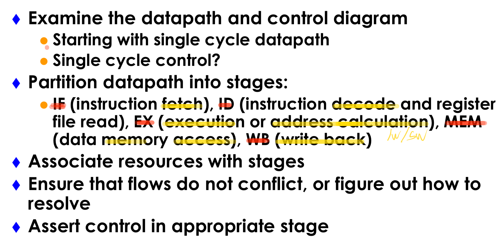
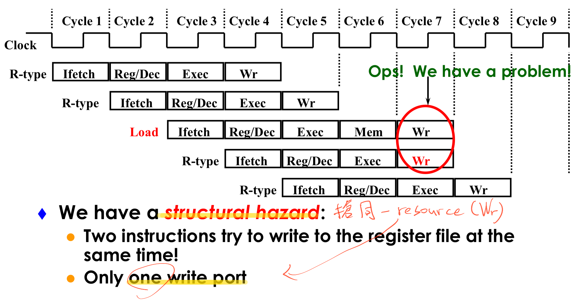

* An overview of pipelining
* A pipelined datapath

    

    * structural hazard

        

* Pipelined control
* Hazards: types of hazard
* Handling data hazards
    * Inserting NOP（software）
    * Forwarding, R-Type-use（hardware)
    * Stalls, load-use (hardware)
* Handling branch hazards
* Exceptions
* Superscalar and dynamic pipelining