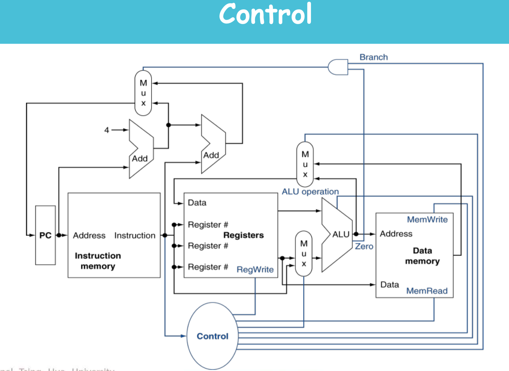
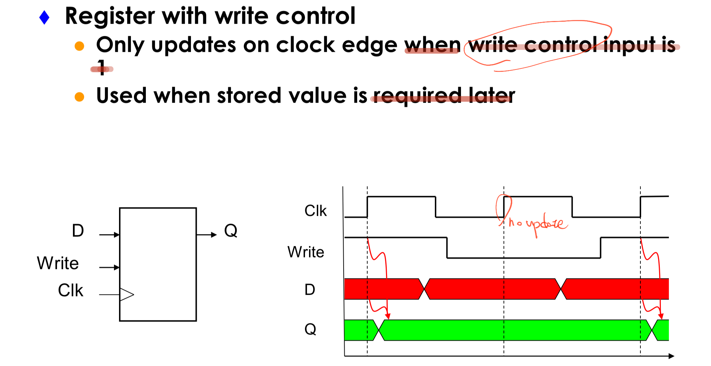
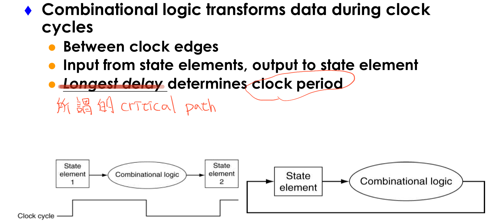

* Introduction to designing a processor
    * Instruction excution

        

    * Register with write control

        

    * Clocking methodology

        

* Analyzing the instruction set（step 1）
* Building the datapath（steps 2 and 3）
* A single-cycle implementation
* Control for the single-cycle CPU（steps 4 and 5）
    * Control of CPU operations
    * ALU controller
    * Main controller
* Adding jump instruction